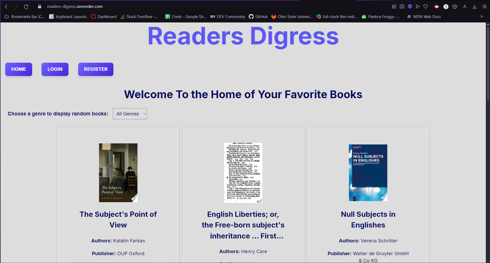

# Readers Digress
## Description
Readers Digress is a webpage aimed to bring bibliophages together! The webpage allows for a bustling community of avid readers to talk to each other about their favorite stories. You can make personal accounts that will track your talks with other users. The site will also let you view any books allowed on the google books api and add them to a wishlist of books you'd like to read and another list of books you have read, that you would like to talk with others about.
## Demo w/Link

link: https://readers-digress.onrender.com

## Contact Us
- GitHub:  
[EddieJae24](https://github.com/EddieJae24) 
          https://github.com/stevens38 
          https://github.com/MavMMSZ 
- Email: 
 tetraed.llc@gmail.com 
         maverickmmsc@gmail.com 
         steven38@marshall.edu

